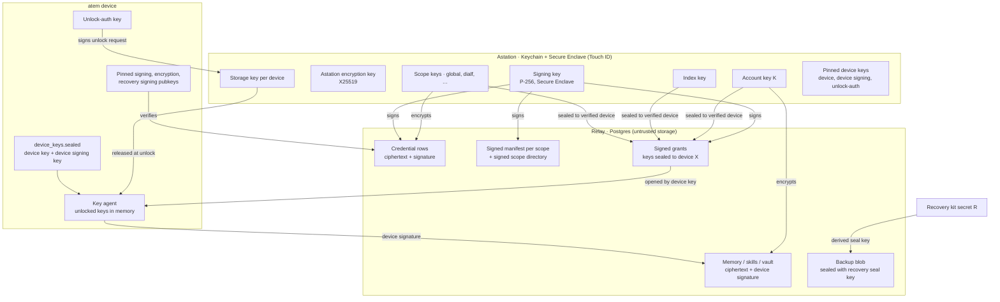
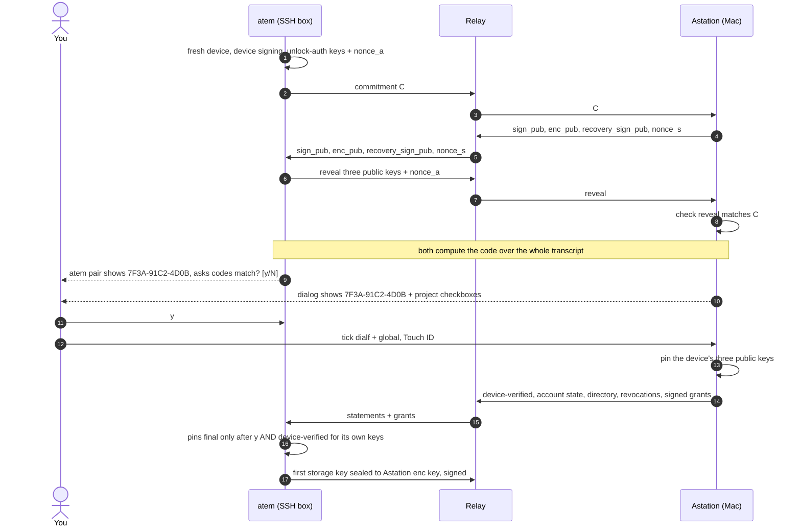
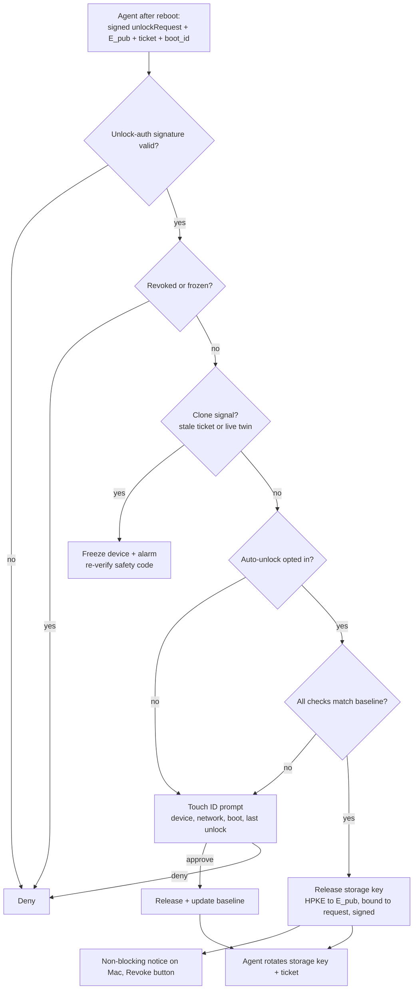
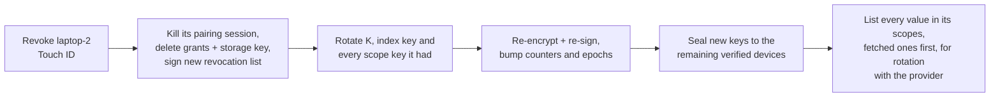
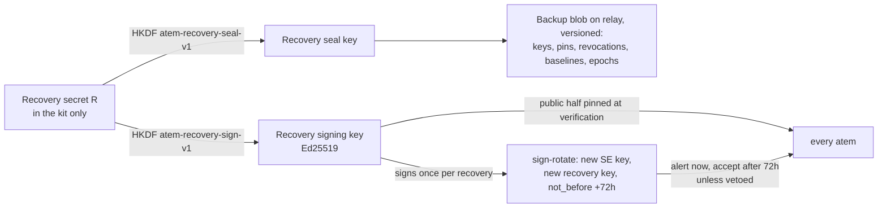
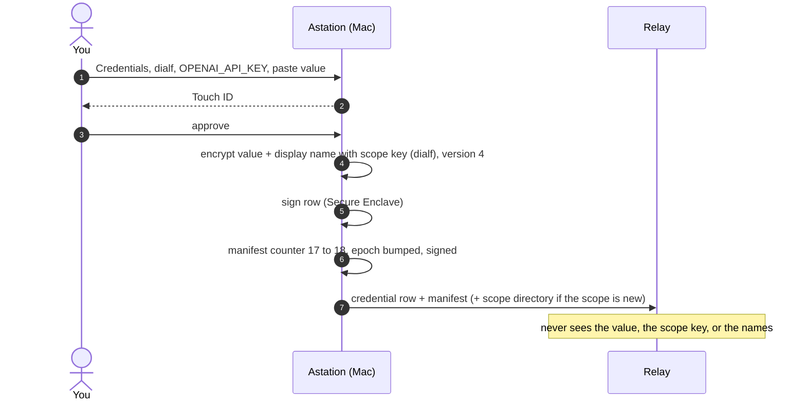
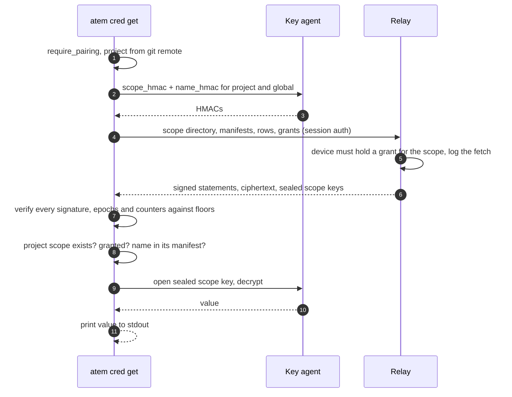

# End-to-end encryption: memory, skills, vault and credentials

Status: build steps 0–1 are built on the atem side (2026-10-09): signed
account state and plain-text rejection (fixes to #36), and device
verification (commit-then-reveal safety code, signed device certificate,
signed account state, signed RFC 9180 HPKE grants for `K`). Build step 2a
is built on the atem side (2026-10-10): `device_keys.sealed` under a
storage key held by the home Astation, the key agent (`atem key-agent`),
Touch ID unlock through Astation, storage-key rotation at every unlock,
and `atem cred unlock|lock|status`. The Astation side of steps 0–2a is
pending (see "Astation work for steps 0–1" and "Astation work for step
2a"); until it lands, atems stay unverified and keep plain-text sync.
Moving `K` behind the agent (2b), device-signed writes (3), the recovery
secret (4), credentials (5–6, 8) and auto-unlock (7): design approved for
planning (2026-10-09), hardened after an independent security review the
same day (see "Review findings"). Not built.
Owner: Brent G

## Goal

The relay (station.agora.build) stores memory, skill files, vault entries
and credentials. Anyone who can see the server's data must see only
ciphertext, and anyone who controls the relay must not be able to read,
forge, swap or silently roll back what atems use:

- whoever operates the server, Coolify, or the Postgres container;
- database backups and dumps;
- Cloudflare, which terminates TLS in front of the relay;
- an attacker who breaches any of the above.

Only devices you verified, with keys Astation granted them, can read
content. Two kinds of data, one foundation:

| Data | Key | Encryption | Who writes |
|---|---|---|---|
| Memory, skills, vault notes | account key `K` | **optional**, off by default, switched in Astation's settings | any verified atem, each write signed by its device signing key |
| Credentials (`atem cred`) | one scope key per project, plus global | **always on**, no plain-text mode | Astation only, with Touch ID |

Both share the same trust root (Astation), device verification, sealed
device key, unlock policy and recovery kit, described once below.

## Non-goals

- Hiding *that* data exists, its size, timing, which atem wrote it, or
  which device fetched which credential version.
- **What an agent does with a value.** `atem cred get` prints the value, and
  from then on it may end up in the agent's context, transcripts and
  provider logs. This is accepted.
- **Root or malware on a granted device.** While that device is unlocked it
  can read everything it was granted and write memory as that device.
  Grants per project and revocation limit the damage.
- **Availability.** The relay can withhold data, including recent memory
  writes and invalidations. It can't read, forge or reorder it without
  detection (see "Threat model" for what withholding can still do).
- Encrypting Astation's own relay traffic (pairing, voice, tasks). This
  covers stored data and the key exchanges below.

## Threat model

| Attacker | Result | Why |
|---|---|---|
| Relay database dump, stolen backup | protected | Rows hold only ciphertext, keys sealed to devices, signatures and HMAC'd names. No key that decrypts anything is on the server. |
| Relay operator or Cloudflare, actively malicious | protected (can deny service) | Key swaps fail the commit-then-reveal safety code. Every key grant, mode change, credential row, manifest and memory write is signed. Older credential values fail the signed counters and epoch floor. Plain text is rejected while encryption is on. |
| Relay hides an invalidation or a recent memory write | partial | atem never accepts an older state of a record it already has, but a device that never saw the newer write can be shown the older one. This is withholding, not forgery. |
| Valid pairing session on an unverified device | protected | Astation seals keys only to verified device keys, and other devices drop writes without a certified device signature. |
| Another non-root user on the box | protected | Files are 0600. The key agent socket is 0600 and checks the caller's UID (`SO_PEERCRED`). |
| Copied disk, VM snapshot or backup of a box | protected with Touch ID unlock; mostly protected with auto-unlock | The device keys are sealed (`device_keys.sealed`) by a storage key only Astation holds, and the storage key changes at every unlock, so copies older than the last unlock can't be opened. See "Unlock policy". |
| Revoked device | partial | Its pairing session is killed; `K`, the index key and its scope keys are rotated; its writes are rejected by every device. It keeps what it already read. Every value in its scopes is listed for rotation at the provider. |
| Root or malware on a granted device | exposed | Out of scope. Limited to what that device was granted. |
| Stolen Mac | protected | Keys are in the Keychain and Secure Enclave behind Touch ID. Restore on a new Mac from the recovery kit. |
| Stolen recovery kit + control of the relay | delayed and visible | A signing-key replacement takes effect only after 72 hours, every atem alerts you at once, and the current Mac can veto it. |
| Plain text from before encryption was turned on | exposed in old backups | The relay purges it, but database backups taken earlier still contain it. |

## Decisions

| Topic | Decision |
|---|---|
| Memory encryption | Optional, off by default, switched in Astation. Mode changes are signed by Astation; atem never moves toward plain text without one. Turning off goes through `disabling`. |
| Credentials encryption | Always on. |
| Offline credential reads | Grants per device. A device decrypts on its own while Astation is offline. |
| Credential grant granularity | Per project scope. `global` is a scope. |
| Who writes credentials | Astation only, Touch ID for every create, update, delete, grant and revoke. |
| Who writes memory | Any verified device. Every write is signed by that device's signing key, certified by Astation. |
| Signing key | Secure Enclave P-256. It can't be extracted, and each signature needs Touch ID. |
| Device verification | Required once per device, before any sync: commit-then-reveal safety code, confirmed on **both** sides (`atem pair` asks `codes match? [y/N]`, Astation asks for Touch ID). |
| One rule for every key | No key of any kind (`K`, scope keys, index key, storage key) goes to an unverified device. Every grant is signed. |
| Keys on disk (atem) | The device keys are sealed (`device_keys.sealed`) by a storage key held only by Astation, rotated at every unlock. No passphrase. |
| Unlock after reboot | Touch ID by default. Auto-unlock is a per-device opt-in, guarded by checks. Unlock requests are signed by a per-device unlock-auth key. |
| Device key | atem's own X25519 key, generated fresh at verification, never the system SSH keys. |
| Credential names | `[A-Za-z0-9][A-Za-z0-9._-]{0,63}`. Spelling kept for display; unique and looked up case-insensitively. |
| Forked repos | A fork is a separate project, with no credential grants until you add them. |
| Fetch log | The relay records (device, credential, version, time) for every credential fetch. Best effort: revocation treats every value in the device's scopes as exposed. |
| Recovery | One kit, one secret `R`. Every recovery key is derived from `R`. A replaced signing key takes effect after **72 hours**; a new `R` is issued after every recovery. |
| `atem cred add` | Optional, not required for v1. |

## Keys

Astation is the root of trust and holds every shared key. Astation never
shows memories, skills or vault notes; it stores keys and hands them to
verified devices. Credentials get keys of their own, separate from `K`, so
holding `K` never opens a credential.

| Key | Type | Purpose | Held by |
|---|---|---|---|
| Account key `K` | 256-bit random, short id `kid` | Root of memory, skills and vault encryption; used only through HKDF subkeys | Astation Keychain; every verified device, sealed |
| Scope key | 256-bit random, one per credential scope | Encrypts the credential values of one project (or global) | Astation Keychain; granted devices, sealed |
| Index key | 256-bit random | HMACs credential names and project keys, so the relay can look up rows without learning names | Astation Keychain; every verified device, sealed |
| Signing key | P-256, Secure Enclave, generation `sign_gen` | Signs every grant, mode change, device certificate, revocation list, credential row and manifest | Astation only; atems pin the public half |
| Astation encryption key | X25519 | Receives keys sealed *to* Astation (storage keys) | Astation Keychain, sealed by the Secure Enclave; public half certified by the signing key and covered by the safety code |
| Device key | X25519, generated on the device | Opens keys sealed to this device | The device only, inside `device_keys.sealed` |
| Device signing key | Ed25519, generated on the device | Signs this device's memory, skill and vault writes, ticket rolls and storage-key rotations | The device only, inside `device_keys.sealed`; public half certified by Astation |
| Unlock-auth key | Ed25519, generated on the device | Signs unlock requests while the device key is still locked | The device, **unsealed** on disk (0600); public half pinned by Astation |
| Storage key | 256-bit random, one per device, replaced at every unlock | Seals `device_keys.sealed` on disk | Astation Keychain only; agent memory while unlocked |
| Recovery secret `R` | 256-bit random | Root of recovery. See "Recovery kit" | The recovery kit only |

Subkeys, so no key is used for two jobs:

```
K_enc     = HKDF-SHA256(K, info = "atem-k-enc-v1")       # AEAD for memory, skills, vault
K_project = HKDF-SHA256(K, info = "atem-k-project-v1")   # HMAC of memory project keys
K_dedupe  = HKDF-SHA256(K, info = "atem-k-dedupe-v1")    # HMAC content_hash
I_name    = HKDF-SHA256(index_key, info = "atem-idx-name-v1")
I_scope   = HKDF-SHA256(index_key, info = "atem-idx-scope-v1")
```



**Scope keys are random, not derived.** One project's key tells you nothing
about another's. Astation keeps the table `project key → (scope key, kid)`
in its Keychain. The relay knows a project only as
`scope_hmac = HMAC(I_scope, project_key)`.

**Why the signatures.** A scope key keeps a value secret; it doesn't prove
who wrote it. Every device granted DialF holds DialF's scope key, so a
compromised laptop could encrypt a fake value, and the relay can seal a key
of its own choosing to any device's public key. So every credential row,
manifest and grant carries Astation's signature, and every memory write
carries the writer's device signature, certified by Astation.

**Why not the system SSH keys.** They are often copied between machines,
which breaks per-device revocation. They often sit in `ssh-agent`,
a hardware token or a forwarded agent, which can sign but can't decrypt.
Using one key for both SSH login and decryption is bad practice. Rotating
an SSH key would silently cut off access. And the public half is published
at `github.com/<user>.keys`.

**One device key for every grant** is safe because each seal is real HPKE
with its own `info` (`atem-grant-info-v1`: account, type, device, kid and
scope), and Astation signs a statement over the same fields plus a hash of
the seal's output, so a seal made for one purpose can't be opened as
another.

## Signed statements

Everything an atem trusts comes from one of these statements. Each starts
with its own label, names the account and the signing-key generation, and
is encoded with the length-prefixed encoding in "Formats". atems reject a
statement whose `sign_gen` isn't their pinned generation.

| Statement | Signed by | Fields | Purpose |
|---|---|---|---|
| `atem-account-state-v1` | signing key | account, sign_gen, mode, kid, epoch | Memory encryption mode. atem keeps the highest epoch and never moves toward plain text without one. |
| `atem-device-verified-v1` | signing key | account, sign_gen, device_id, device_pub, device_sign_pub, unlock_auth_pub, transcript, epoch | Certifies a device after the safety code; gives the device its first epoch floor. `transcript` binds it to one ceremony (see "Verification"). |
| `atem-grant-v1` | signing key | account, sign_gen, type (`K` / `index` / `scope`), device_id, device_pub, kid, scope_hmac, SHA-256(sealed key) | Proves Astation, not the relay, sealed a key to this device. |
| `atem-scope-directory-v1` | signing key | account, sign_gen, epoch, [scope_hmac] | Every credential scope that exists, so a missing project scope can't be faked. |
| `atem-cred-row-v1` | signing key | account, sign_gen, scope_hmac, kid, name_hmac, version, SHA-256(ciphertext), SHA-256(encrypted display name) | One credential version. |
| `atem-cred-manifest-v1` | signing key | account, sign_gen, scope_hmac, kid, counter, epoch, [(name_hmac, version, ct_hash)] | Every credential in a scope; counter is monotonic across `kid` rotations. |
| `atem-revoked-v1` | signing key | account, sign_gen, epoch, [device_id] | Devices whose writes are rejected and whose grants are void. |
| `atem-mem-write-v1` | device signing key | account, device_id, record id, kind, scope, project_hmac, version or entry number, validity (valid_at, invalid_at, superseded_by), SHA-256(each encrypted field) | One memory, skill or vault write, including invalidations. |
| `atem-unlock-request-v1` | unlock-auth key | account, device_id, boot_id, ticket (empty until auto-unlock), e_pub, nonce, time (Unix seconds), storage_kid | Asks the home Astation to release this device's storage key, sealed to the single-use `e_pub`. |
| `atem-unlock-grant-v1` | signing key | account, sign_gen, device_id, storage_kid, SHA-256(request statement bytes), SHA-256(sealed storage key) | Astation's answer to exactly one unlock request; the device opens the seal only if it matches. |
| `atem-storage-rotate-v1` | device signing key | account, device_id, old_storage_kid (empty at first sealing), new_storage_kid, SHA-256(sealed new storage key) | Hands Astation the next storage key (sealed to `astation_enc_pub`) while it keeps the old one. |
| `atem-storage-ack-v1` | signing key | account, sign_gen, device_id, new_storage_kid | Astation stored the new storage key as pending. |
| `atem-storage-confirm-v1` | device signing key | account, device_id, new_storage_kid | The device switched to the new storage key; Astation may drop the old one. |
| `atem-storage-abandon-v1` | device signing key | account, device_id, storage_kid | The device gives up a pending storage key it holds no file for; Astation drops its pending key only if it is exactly this one. |
| `atem-sign-rotate-v1` | recovery signing key | account, old sign pub, new sign pub, new_gen, new recovery sign pub, not_before | Replaces the signing key after a recovery; valid only after `not_before` (72 hours). |
| `atem-sign-veto-v1` | current signing key | account, sign_gen, vetoed new_gen | Cancels a pending replacement from the current Mac. |

## Devices

### Verification (once per device)

Verification uses commit-then-reveal, so a relay in the middle can't search
for two key sets that produce the same short code: it gets one guess with a
2⁻⁶⁰ chance.

1. atem generates a **fresh** device key, device signing key and unlock-auth
   key (never reusing today's plain `device_key`, which old backups hold),
   and a random 32-byte `nonce_a`. It sends only the commitment
   `C = SHA-256(enc("atem-verify-commit-v1", device_pub, device_sign_pub, unlock_auth_pub, nonce_a))`.
2. Astation, having received `C`, sends its signing public key, its
   encryption public key, the recovery signing public key and a random
   `nonce_s`.
3. atem reveals its three public keys and `nonce_a`. Astation checks them
   against `C` and aborts on mismatch.
4. Both sides compute the safety code over the whole transcript:
   `code = base32(SHA-256(enc("atem-safety-code-v1", device_pub, device_sign_pub, unlock_auth_pub, astation_sign_pub, astation_enc_pub, recovery_sign_pub, nonce_a, nonce_s)))[:12]`,
   shown as `7F3A-91C2-4D0B`.
5. **Both sides confirm.** `atem pair` prints the code and asks
   `codes match? [y/N]`. Astation's dialog shows the same code, the device
   name and a checkbox for each credential project; you confirm with Touch
   ID. Either side answering no aborts and discards everything.
6. Until both confirmations are in, atem's pins are **pending** and it
   fails closed: no grant is used and nothing syncs. They become final when
   atem has answered `y` **and** received an `atem-device-verified-v1`
   statement for exactly the keys it revealed **and this ceremony**: the
   certificate carries
   `transcript = SHA-256(enc("atem-verify-transcript-v1", C, nonce_a, nonce_s))`,
   and atem rejects one whose transcript differs from its own. A device
   that verifies again with the same keys can't be handed a recorded
   certificate from an earlier ceremony.
7. Astation pins the device's three public keys (in the Keychain, never on
   the relay) and sends the current `atem-account-state-v1`,
   `atem-scope-directory-v1`, `atem-revoked-v1`, and signed grants: `K`, the
   index key, and each ticked scope key. The device seals its first storage
   key to Astation's encryption key (see "Keys on disk").
8. **Epochs.** Astation signs the certificate at epoch `E` and then
   re-signs the current account state at a later epoch (`E+1`), so in
   `deviceVerified` the account state's epoch is always `>=` the
   certificate's. atem rejects a state older than the certificate. The
   certificate's epoch becomes the device's floor.
9. atem checks everything in `deviceVerified` (certificate, account state,
   kid, every grant) before writing anything. If any check fails, nothing
   is saved: no pin, no device keys, no key, no mode.
10. On a device's **first** verification with an Astation, atem drops what
    the old unauthenticated path stored for it: that Astation's mode entry
    and the account's `K`, rotation history and project names. Only what
    arrives signed is kept.
11. If the signed state needs `K` and none arrived (or none is stored),
    atem sends `keyRequest` right after verification. It does the same
    when an `encryptionMode` repeats the stored state while `K` is still
    missing.

**Re-verification.** Verifying again with an Astation this device already
trusts never moves it backwards: a certificate older than the account
state already applied is rejected, the epoch floor only rises
(`max(old floor, old state epoch, certificate epoch)`), and the stored
signed state is kept until a newer one arrives.



**Verification comes before any sync.** atem uploads memory only once it
holds a signed `atem-account-state-v1`, which arrives with verification.
That's true even for accounts with encryption off, so a hostile relay can't
make a new device upload plain text by claiming the account is off.

If a device key changes (reinstall, deleted files), Astation refuses grants
until you verify again. Devices that received `K` under the earlier
trust-on-first-use flow get nothing new until they verify, and their writes
are dropped by verified devices because they have no certified signing key.
`K` is rotated once verification ships (see "Migration").

The #36 fingerprint (`SHA-256(device_pub)` cut to 8 bytes, covering only
the device key, computed without commitments) has been replaced by the
safety code.

### Sealing a key to a device

Every key travels as **HPKE (RFC 9180)**, base mode, DHKEM(X25519,
HKDF-SHA256), HKDF-SHA256, ChaCha20-Poly1305, which binds the ephemeral
and recipient public keys into the key schedule. The HPKE `info` is
`enc("atem-grant-info-v1", account, type, device_id, device_pub, kid,
scope_hmac)`, and Astation signs the `atem-grant-v1` statement, which adds
`SHA-256(enc(encapped_key, ciphertext))`. (The info can't contain a hash
of the seal's own output.) atem opens a grant only if the signature
verifies, `device_id` and `device_pub` are its own and equal its pinned
device key, `sign_gen` is pinned, and a `K` grant names no scope. The
relay can carry grants but can't make one.

The #36 wrap (no salt, no device id, no signature) has been replaced by
this, and `keyGrant` carries the signed statement; `keyGrant` messages
without one are ignored.

### Keys on disk (atem)

Build step 1 kept the device keys in a plain `device_keys` file, protected
only by mode 0600, so a copied disk could use them. Build step 2a replaces
it with:

- `device_keys.sealed`: the device key and device signing key, encrypted
  with the **storage key**, whose only job is to protect that file.
- `unlock_auth_key`: an Ed25519 key, unsealed (0600). It can only *ask* for
  an unlock; Astation still decides. A disk copy has it (accepted); the
  relay doesn't.

Properties:
- The sealed file alone is useless, and so is the storage key alone.
- The device keys never leave the box. Astation holds only a key that opens
  one file on one machine.
- **The storage key rotates at every unlock.** After unlocking, the agent
  generates a new storage key, re-seals `device_keys.sealed` (write to a
  temp file, fsync, rename), and sends the new storage key sealed to
  Astation's encryption key, signed by the device signing key. Astation
  keeps the old storage key until it gets the confirmation, then deletes it.
  A copy of the disk from before the latest unlock can't be opened, even by
  someone who stole an earlier storage key.
- Once unlocked, the device keys and every key they opened (`K`, index key,
  scope keys) live only in a small **key agent**, like ssh-agent: a Unix
  socket at `$XDG_RUNTIME_DIR/atem/agent.sock` (falling back to
  `~/.config/atem/agent.sock`, never `/tmp`), 0600 with the caller's UID
  checked, `mlock`ed memory where the limit allows (see below), `zeroize`,
  no core dumps (`PR_SET_DUMPABLE=0`). The agent never hands out raw keys:
  callers ask it to decrypt, sign or compute an HMAC, and get only the
  result. It stays unlocked until it exits (a reboot, or the end of the
  user's login if the system kills user processes then) or `atem cred
  lock`, and survives atem upgrades so prompts come only after real
  reboots.

The OS keychain isn't used: Secret Service needs a desktop session and the
macOS login keychain is locked in SSH sessions, and most atems run over SSH.

**How build step 2a builds it.**

- `device_keys.sealed` is JSON `{version: 1, device_id, storage_kid, nonce, ciphertext}`:
  XChaCha20-Poly1305 under the storage key, associated data
  `enc("atem-device-keys-v1", device_id, storage_kid)`. `storage_kid` is 8
  lowercase hex characters, new at every rotation. After opening a file
  the agent requires its header `device_id` to be the pinned one and its
  `storage_kid` to be the one Astation released.
- The agent is the same binary, `atem key-agent` (hidden), started on demand
  by the first command that needs keys and detached with `setsid`; it logs
  to `~/.config/atem/key-agent.log`. It speaks newline-delimited JSON; every
  request carries `"v": 1` and any other version gets an error (an old agent
  left running after an upgrade says so; stop it and the next command starts
  the new one). It refuses peers whose UID isn't its own, sets
  `PR_SET_DUMPABLE=0`, and locks its memory with `mlockall` only when
  `RLIMIT_MEMLOCK` is unlimited or at least 512 MiB (Linux): with
  `MCL_FUTURE` every allocation past the limit would fail, and the usual
  default (8 MiB, or 64 KiB on older systems) is far too small, so on most
  machines it logs that it skipped the lock and keys could reach swap (use
  encrypted swap, or raise the limit for the user). It never talks to the network: the
  CLI carries its messages to Astation, and the storage key never passes
  through the CLI in plain form. A key-file error never stops it from
  starting: it starts locked and logs the error.
- **Agent lifetime.** The agent is detached with `setsid` but still runs
  in the user's login session. Where systemd-logind has
  `KillUserProcesses=yes` (some distributions' default), it is killed when
  that session ends. Where it isn't, the agent can outlive the user's last
  session, but logind still removes `$XDG_RUNTIME_DIR` (and the agent's
  socket with it) then: nobody could reach the agent any more. So every
  5 seconds the agent checks that its socket file is still the one it
  bound (same inode) and that `agent.socket` still names it; if not, it
  wipes its keys and exits, freeing the key directory's lock. Either way
  the next command starts a locked agent and `atem cred unlock` asks
  Astation again. `loginctl enable-linger <user>` keeps the runtime dir,
  and so the agent, across logouts. Nothing is lost when the agent stops:
  the keys stay sealed on disk (or in the plain file before the first
  escrow).
- **One agent per key directory.** The agent takes an exclusive `flock` on
  `~/.config/atem/key_agent.lock` for its whole life and exits if another
  agent holds it, so two login sessions with different `$XDG_RUNTIME_DIR`s
  never run two agents over one set of key files (each would rotate the
  storage key and strand the other's sealed files). It records its socket
  path in `~/.config/atem/agent.socket` (0600, written atomically) and its
  pid in the lock file; clients try that path first, then their own
  session's, and still refuse a listener that isn't their user. A starting
  agent that finds the lock held waits up to 8 seconds for the holder to
  answer on its recorded socket (then it exits: one is running) or to go
  away (an orphaned agent exits by itself, see above). If neither happens,
  the starting agent and the client that started it print an error naming
  the holder's pid and the `kill <pid>` that stops it.
- **Home Astation.** One storage key per device, held by the device's first
  verified Astation and recorded as `home_astation` in `cred_state.json`;
  the home never moves. Unlock and rotation go only through the home
  Astation; grants from any verified Astation are opened by the unlocked
  agent.
- **First sealing.** On the home Astation's first verification, `atem pair`
  seals the fresh keys under a new storage key, also writes them to a plain
  `device_keys` file (0600, atomically), hands the unlocked keys to the
  agent, and in the same run sends the storage key to Astation
  (`storageKeyRotate` with an empty old `storage_kid`) and confirms it.
  Plain keys exist until the first escrow: a fresh device follows the same
  rule as a build-step-1 device. A plain `device_keys` file is sealed under
  a fresh storage key each time the agent starts while that file exists
  (never reusing the kid of the sealed file it overwrites); the key goes to
  Astation at the next `atem pair` or `atem cred unlock`, and the plain file
  is deleted only once Astation is known to hold the key (a confirmed
  escrow, or an unlock that opened the current sealed file). So an agent
  that stops before the escrow (a reboot, a crash, `atem cred lock`, which
  is always allowed) loses nothing, and atem needs no Astation with step
  2a: against an older Astation the escrow just doesn't complete and the
  device keeps its plain keys, as in step 1.
- **`escrowed_storage_kid`** in `cred_state.json` is the last storage kid
  Astation is known to hold (set at every confirmed escrow or rotation and
  by an unlock that opened the current file). `atem cred status` uses it to
  flag a sealed file Astation may not hold, and new storage kids never
  reuse it, the current kid, or any kid the device ever abandoned
  (`abandoned_kids`).
- **Rotation at every unlock, crash-safe in three phases.** (1) The agent
  writes `device_keys.sealed.next` under a new storage key and atem sends
  `storageKeyRotate`. (2) Astation stores the new key as pending, keeps the
  current one, and replies `storageKeyAck`. (3) The agent checks the ack,
  renames `device_keys.sealed` to `device_keys.sealed.prev` and `.next` over
  `device_keys.sealed`, and atem sends `storageKeyConfirm`; Astation makes
  the pending key current and deletes the old one. Only one rotation is
  pending at a time. Until it is confirmed Astation releases whichever key a
  request names. An unlock request names the current file's kid, or the
  `.next` or `.prev` file's only when the current file is missing (an
  unreadable current file fails closed); the grant must release exactly
  the `storage_kid` the request names, and the agent opens the file that
  carries it. A released `.next` is promoted then, and a lone `.prev` (no
  current file) becomes the current file again. `.prev` is deleted after an
  unlock that releases the current file's kid, which proves Astation holds
  it; if a current file appears while an unlock that named `.prev` is in
  flight, it is kept and no rotation starts until an unlock opens it. A lost
  confirmation is settled at the next unlock or rotation, which names the
  new kid. A failed rotation after an unlock is a warning: the keys stay
  unlocked and the key rotates at the next unlock.
- **Abandon.** If Astation holds a pending key the device has no file for
  (a crash after the ack, before the rename), the device signs
  `atem-storage-abandon-v1` for that kid and rotates again. The agent signs
  one only when no sealed file (current, `.next`, `.prev`) and no rotation
  in progress carries that kid (a stale `.next` is deleted first), and
  records the kid so it is never used again.
- Until build step 2b, the agent opens `K` grants and hands `K` back to the
  caller for `data_keys.enc`; grants that arrive while it is locked are
  ignored and requested again after `atem cred unlock`.

### Unlock policy

The unlock request is signed by the unlock-auth key and bound to its reply:

1. The agent creates a single-use X25519 key `E` and a nonce. atem sends
   `unlockRequest` with the statement `atem-unlock-request-v1` (account,
   device_id, boot_id, ticket, E_pub, nonce, time, storage_kid), signed by
   the unlock-auth key. `storage_kid` names the key that opens the sealed
   file on disk; `ticket` is empty until auto-unlock (build step 7);
   `time` is Unix seconds. `boot_id` is Linux's
   `/proc/sys/kernel/random/boot_id`; on macOS it is empty for now (a later
   step can send `sysctl kern.bootsessionuuid`), so Astation can't tell a
   Mac's reboots apart by it.
2. Astation checks the signature against the pinned unlock-auth key and
   `time` against its clock, then applies the policy below.
3. If it releases, it seals the storage key named by `storage_kid` (current
   or pending) with HPKE to `E_pub`, `info = enc("atem-unlock-info-v1",
   account, device_id, storage_kid, SHA-256(request statement bytes))`,
   empty AAD, and signs `atem-unlock-grant-v1` (account, sign_gen,
   device_id, storage_kid, SHA-256(request statement bytes),
   SHA-256(enc(encapped_key, ciphertext))). The agent opens it only if the
   request carries its own `E_pub`, nonce and storage_kid, the hashes match
   and the signature is the pinned home Astation's; `E` is used once. A
   relay that swaps `E_pub` breaks the unlock-auth signature; a replayed
   reply doesn't match a new request.

Policy:

- **Touch ID by default.** Every unlock request shows a prompt on the Mac
  with the device name, what changed, the network and boot time the relay
  saw, and when it last unlocked. An unexpected prompt is the alarm. The
  choices are Approve, Deny, and Deny and revoke.
- **Auto-unlock is a per-device opt-in** for unattended servers. Astation
  releases the storage key without a prompt only while every check below
  matches the approved baseline. Any change falls back to Touch ID.



| Check | Observed by | Catches |
|---|---|---|
| Live twin: the device connected twice, or an unlock while its session is live | relay | a clone running next to the real box |
| Rolling ticket: a new one at every unlock **and every 15 minutes while the agent runs** | Astation | a clone with an older ticket, within minutes while the real box is online |
| Network: subnet, ASN or country changed (not the exact IP) | relay | the disk running somewhere else |
| TPM attestation, when present | device, signed by the TPM | different hardware |
| Cloud instance identity (AWS / GCP / Azure signed document) | device, signed by the provider | a different VM or snapshot |
| Boot ID unchanged since the last unlock, or more than 3 unlocks a day | device / Astation | restart loops, scripted attempts |
| atem version went down; hostname, machine-id or OS changed | device | careless clones (hints only; a copy can fake these) |
| Device revoked or frozen | Astation | always denied |

**Ticket rolling.** While unlocked, the agent sends the current ticket,
signed by the device signing key, every 15 minutes and receives the next
one. It writes the new ticket to disk (temp file, fsync, rename) before
acknowledging; Astation accepts the previous ticket until the
acknowledgement arrives, so a crash between the two never freezes a device
by mistake. A request with any older ticket is a clone signal.

Rules:
1. Astation decides. The relay only reports what it observes.
2. Checks can only add friction (auto-unlock → Touch ID → deny), never
   remove it.
3. The baseline updates only after a Touch ID approval.
4. A clone signal (stale ticket or live twin) freezes the device until you
   verify it again in person.
5. Every auto-unlock sends a non-blocking notice to the Mac with a Revoke
   button.

Astation's grant dialog shows each device's unlock mode, so you can choose
not to grant sensitive projects to auto-unlock devices.

**What remains with auto-unlock:** a disk copy taken after the latest
unlock and ticket roll, run inside your own network on a box with no TPM or
cloud identity check, while the real box is offline. The real box's next
ticket roll or unlock detects it and freezes the device. A malicious relay
could also hide a network change. Neither applies with Touch ID.

**Everything shares the unlock.** After a reboot, memory sync waits for
the same unlock as credentials, because `K` and the device signing key sit
behind the same sealed file.

### Revoking a device



1. Astation: Devices, Revoke, Touch ID.
2. Astation kills the device's pairing session, deletes its grants and its
   storage key, and signs a new `atem-revoked-v1` list. Every device drops
   writes from a revoked device from then on. It can't unlock after its
   next reboot.
3. `K` and the index key are rotated (see "Rotation"), and every credential
   scope the device held gets a new scope key: values are re-encrypted and
   re-signed, counters and epochs bumped, and the new keys sealed to the
   remaining devices.
4. Astation lists every credential value in the device's scopes, the ones
   the fetch log says it fetched first, so you can rotate them at the
   provider. The fetch log is kept by the relay and is best effort.

## Recovery kit

The Astation recovery kit (`RecoveryKit.swift`, branch `feat/recovery-kit`)
holds the Astation ID and relay URL, but no secret. It gains one line:

```
Recovery key: XXXX-XXXX-XXXX-…   (256 bits, base32)
```

Every recovery key is derived from that one secret `R`:

```
recovery seal key    = HKDF-SHA256(R, info = "atem-recovery-seal-v1")
recovery signing key = Ed25519 seed from HKDF-SHA256(R, info = "atem-recovery-sign-v1")
```



**The backup blob** holds everything a new Mac needs: `K` and previous
keys, every scope key, the index key, every device storage key, the pinned
device keys, the revocation list, unlock baselines, the scope directory,
and the current epochs and counters. It carries a monotonic `blob_version`
in its associated data. Astation re-seals it after every change. Every atem
reports the highest `blob_version` it has seen (in a device-signed message),
and a restoring Astation refuses a blob older than the highest reported
version.

**Replacing the signing key.** On a new Mac, Astation restores from the
kit, creates a new Secure Enclave signing key, generates a **new** `R`, and
the old recovery signing key signs
`atem-sign-rotate-v1 { account, old sign pub, new sign pub, new_gen, new recovery sign pub, not_before = now + 72 h }`.
Each atem:
- checks that `old sign pub` is its pinned key and `new_gen` is its pinned
  generation + 1, and rejects anything else;
- alerts you **immediately** ("signing key replacement requested via
  recovery kit; takes effect on <time>");
- keeps the old key and refuses credential writes and new grants until
  `not_before`;
- discards the replacement if it receives an `atem-sign-veto-v1` from the
  old signing key before `not_before`;
- after `not_before`, pins the new signing key and the new recovery signing
  key.

Reads of existing credentials and memory keep working during the 72 hours.

Rules:
1. `R` is a fresh random secret, **never `K`**. Every paired atem holds `K`,
   so a recovery signing key derived from `K` would let any atem forge a
   signing-key replacement.
2. Astation never keeps `R`. After showing the kit it keeps only the
   recovery signing *public* key and the derived seal key (Keychain, sealed
   by the Secure Enclave), which it needs to update the backup blob. The
   recovery signing private key exists only while setting up and during a
   recovery, re-derived from the kit.
3. **A new kit after every recovery.** The rotation pins a new recovery
   signing key, so the old kit stops working once the replacement takes
   effect. Astation shows the new kit and requires saving it.
4. The kit is shown behind Touch ID or the Mac password. Turning on memory
   encryption or credentials requires saving the new kit first: the button
   stays disabled until you confirm. Kits saved before this change can't
   recover keys.
5. Whoever has the kit and can wait 72 hours without a veto can take over.
   The immediate alert on every atem and the veto from the current Mac are
   the defenses; if the Mac is really lost, nobody vetoes and recovery
   simply completes.
6. Any atem that still holds `K` can also re-grant it to a new Astation
   (`keyOffer`, approved on both sides), but credentials and the signing key
   come back only from the kit.

If you lose the Mac and the kit, and no atem holds `K`, the data is gone
for good. That's the point of the design.

## Memory, skills and vault notes

### The Astation setting

Settings → **Security** → "End-to-end encrypt memory, skills and vault"
(off by default).

**Turning it on:**
1. Astation creates `K` (if needed) and asks for Touch ID or the Mac
   password.
2. It requires saving the recovery kit (see above).
3. It signs `atem-account-state-v1 { mode: enabling, kid, epoch+1 }` and
   sends it to the relay (`relayEncryption`) and to every atem
   (`encryptionMode` now carries the signed statement). The relay stores the
   mode per account.
4. A verified device without `K` sends `keyRequest` and receives a signed
   `keyGrant`. When every atem has migrated, Astation signs `on`.

**While it's on**, atem refuses to upload plain text and **rejects any
downloaded field that isn't encrypted** (`e1.`/`h1.`), so the relay can't
inject plain-text memory into the managed blocks that agents read. The
relay also refuses plain-text uploads, so an old atem gets a clear error
("this account requires encryption; update atem").

**Turning it off** (confirmation and Touch ID required; it warns that the
data becomes readable on the server again):
1. Astation signs `disabling` (the Secure Enclave signature needs Touch ID).
   atem acts only on a signed statement with a higher epoch than the one it
   holds; an unsigned or older mode message is ignored.
2. Each atem holding `K` pulls, decrypts and re-uploads plain text. The
   relay deletes the ciphertext rows.
3. When no ciphertext remains, Astation signs `off`, and atems delete `K`.

### What gets encrypted

| Data | Encrypted | Stays plain (the relay needs it) |
|---|---|---|
| Memory | `content` | id, scope, machine, confidence, source, timestamps, validity, seq |
| Memory | | `project`: `HMAC(K_project, key)` |
| Memory | | `content_hash` becomes `HMAC(K_dedupe, content)` |
| Skill | every file's bytes, and file paths | name, scope, project (HMAC), version, timestamps |
| Vault | entry `content`, `summary` | vault id, entry number, version, writer, timestamps |

- **Format.** `e1.<kid>.<base64(nonce ‖ ciphertext)>`, XChaCha20-Poly1305
  under `K_enc` with a random 24-byte nonce. The associated data binds the
  record id, field name, scope, project HMAC, and the version or vault
  entry number, so the relay can't move a ciphertext to another record,
  field, project or entry.
- **Signed writes.** Every write, including an invalidation or replacement,
  carries an `atem-mem-write-v1` signature from the writer's device signing
  key over the record's plain metadata, its validity fields and the hash of
  each encrypted field. Readers check the signature, the writer's
  `atem-device-verified-v1` certificate and the revocation list, and drop
  anything that fails. So the relay can't change validity to bring back an
  invalidated fact, and a revoked device can't write.
- **No going back.** atem never replaces a record it holds with an older
  version or an earlier validity state.
- **Project keys** would reveal repo names. `HMAC(K_project, key)` keeps
  per-project filtering working; atem keeps the hash → name mapping
  locally.
- **`content_hash`** is what the relay dedupes on. A plain SHA-256 of a
  short fact can be guessed; a keyed HMAC can't.
- The local `knowledge.db` stays plain text (mode 0600), so search and
  managed blocks are unchanged. Encryption happens at the HTTP edges
  (`api.rs`, `vault_client.rs`).
- With no key yet, atem queues changes locally instead of sending plain
  text.

### Moving existing data over

On first sync with `enabling`, atem pushes encrypted, signed copies of every
memory and skill it has (in chunks) and asks the relay to purge the
plain-text versions, including skill history and old vault entry versions.
This is the one place the append-only history rule bends. Database backups
taken before the purge still hold the plain text; the purge can't reach
them.

### Rotation

To cut a device off from memory, Astation creates a new `K` with a new
`kid`, signs a new account state, and grants it to the remaining verified
devices, which re-encrypt and push again. atems keep the previous key until
migration finishes. A removed device can still read anything it already
downloaded.

### Costs

- The relay's credential scan stops for encrypted fields. Only atem's
  local, fail-closed scan protects against uploading a credential.
- Server-side features that read content become impossible: server-side
  search, a web view, server-side ranking. None exist today.
- The relay operator can no longer debug content problems by looking at
  rows.
- Every device must be verified before it syncs memory, even with
  encryption off.

## Credentials (`atem cred`)

Credentials store API keys and other secrets with a value that can differ
per project: `openai` in DialF and `openai` in convo-demo are two
different values. They are their own feature: `atem vault` stays the
shared notepad for agents (see [[vault]]) and gets no credential commands.
Memory and skills only *name* a credential (see [[atem-memory]]).

### Projects and isolation

A project is the repo's normalized git `origin` URL, the same key Atem
Memory uses (`src/memory/project.rs`): `git@github.com:Agora-Build/DialF.git`
and `https://github.com/agora-build/dialf` are both
`github.com/agora-build/dialf`. A repo with no remote has no project scope
and sees only global credentials.

Isolation between projects is cryptographic: a device can decrypt only the
scopes whose keys were sealed to it. The relay also refuses to serve rows
for scopes the device has no grant for, but nothing depends on that.

**The current directory is not a security boundary.** `atem cred get`
picks DialF because the current repo says DialF. On one device, any
process running as your user can read every project that device was
granted. To keep two projects apart, give them separate devices: another
box, VM or OS user. Each OS user has its own device keys.

### Names and values

A credential is one name → value pair in a scope. Values are opaque text
up to 64 KB, so PEM keys and JSON service-account files fit. Names keep
their spelling for display (`OPENAI_API_KEY`) and are matched
case-insensitively: `name_hmac` is computed over the lowercased name, and
the original spelling is stored encrypted under the scope key (associated
data: the row's `name_hmac` and `"display-name"`), with its hash in the
signed row. Two names that differ only in case can't exist.

### Writing (Astation only)



1. In Astation: Credentials, pick a project or global, Add / Update / Delete.
2. Touch ID.
3. Astation assigns the next `version` and encrypts the value with the
   scope key: XChaCha20-Poly1305, random 24-byte nonce, associated data
   `enc("atem-cred-v1", account, scope_hmac, kid, name_hmac, version)`.
4. It signs `atem-cred-row-v1`, bumps the scope's manifest counter and the
   account epoch, and signs the new `atem-cred-manifest-v1`. A new scope
   also gets a new signed `atem-scope-directory-v1`.
5. It uploads them. The relay accepts credential writes only from the
   account's Astation session.

atem has no write path. A forged write from an atem would fail every other
atem's signature check anyway.

### Reading (`atem cred get`)



1. `require_pairing`. Find the project from the current repo's remote.
2. The key agent computes `scope_hmac` and `name_hmac` for the project and
   for global.
3. Fetch the scope directory, the manifests, the rows and the device's
   grants, with session auth. The relay refuses scopes the device has no
   grant for and logs the fetch.
4. Verify every signature against the pinned signing key and generation.
   The directory's epoch and each manifest's counter must be at least the
   highest this device has seen; the first floor comes from
   `atem-device-verified-v1`.
5. Decide the scope from **signed** data, never from what the relay omits:
   - If the project scope is in the directory but not granted to this
     device: exit 3. Never fall back to global.
   - If it is in the directory and granted: its manifest is required. Fall
     back to global only if that signed manifest doesn't list the name.
   - If it isn't in the directory: use global.
6. The row must match the manifest entry exactly
   (`name_hmac`, `version`, `ct_hash`). A validly signed older row is
   rejected.
7. The key agent opens the sealed scope key and decrypts the value.
8. Print the value to stdout. Messages go to stderr.

A read needs three things: a valid pairing session (so the relay serves
the rows), the verified device key (the only key that opens the grant), and
the pinned signing key (which rejects anything forged or stale). The relay
controls only the first; the other two never leave your devices.

### Commands

atem, read-only (tier 2, gated with `auth::require_pairing`):

```
atem cred get <name> [--project <key|short-name> | --global]
                      # value only → stdout; current project, then global
atem cred list [--all]
                      # name, scope, version, updated; never values
atem cred status      # verified? safety code, locked?, unlock mode, granted projects
atem cred unlock      # ask Astation to unlock now (get also triggers it)
atem cred lock        # wipe keys from agent memory now
atem cred add <name> [--global]
                      # optional: opens the add dialog on the Mac; value typed there
```

`atem cred get` exit codes:

| Code | Meaning |
|---|---|
| 0 | Found; the value is on stdout |
| 2 | Not found in this project or global |
| 3 | The project has a credential scope, and this device has no grant for it |
| 4 | Locked, and the unlock was denied or timed out |
| 5 | Not paired, or the device isn't verified |
| 6 | Integrity failure (bad signature, stale epoch or counter, row not in manifest); no value printed |

Astation:
- **Credentials tab:** add, update and delete per project or global, each
  behind Touch ID.
- **Devices tab:** verify by safety code, tick projects, Touch ID or
  auto-unlock, revoke.
- **Fetch log** for each credential: which device fetched which version.

Memory names a credential like this: "DialF's OpenAI key is cred `openai`
(project scope)." References to `atem vault get` change to `atem cred get`
in `designs/atem-memory.md` and in the comment and test in
`src/memory/secrets.rs`.

## What each side stores

A plain credential value is never written to disk anywhere.

**Astation (Mac):**
- Signing key: Secure Enclave, can't be extracted.
- Encryption key, `K`, scope keys, index key, storage keys (per device,
  keyed by `(device_id, device_pub)`: one current, at most one pending, and
  every storage kid ever acked), recovery seal key: Keychain items, `WhenUnlockedThisDeviceOnly` (never synced to
  iCloud), each sealed by a Secure Enclave key so a copied Keychain is
  useless on another Mac.
- Pinned device keys (device, device signing, unlock-auth), revocation list,
  unlock baselines, epochs and counters: Keychain.
- Credential values: only in memory while writing or rotating.

**atem (`~/.config/atem/`, all 0600):**
- `device_keys.sealed`: the device key and device signing key, encrypted
  with the current storage key.
- `device_keys`: the same keys in plain, only until the home Astation is
  known to hold the first storage key (a build-step-1 device, or a fresh
  device between `atem pair` and its confirmed escrow, normally the same
  run).
- `device_keys.sealed.next`: exists only between rotation phases 1 and 3;
  `device_keys.sealed.prev`: the file a rotation replaced, kept until an
  unlock proves Astation holds the current key.
- `unlock_auth_key`: unsealed Ed25519 key that can only ask for an unlock.
- `data_keys.enc`: `K` and its previous keys, sealed to the device key.
  (Today it's encrypted with the machine-bound key derived from
  `/etc/machine-id`, which a copied disk includes.)
- Grants cache: signed grant rows, keys still sealed to the device key.
- `cred_state`: pinned Astation keys and generation (and a pending
  replacement, if any), the account epoch floor, highest manifest counter
  per scope, highest `blob_version` seen, the current unlock ticket, the
  latest signed account state, scope directory and revocation list, the
  home Astation that holds the storage key, the last storage kid it is
  known to hold, and every storage kid the device abandoned. Every
  read-modify-write of it holds an `flock` on `cred_state.lock`, so the key
  agent and other atem commands never drop each other's changes.
- `key-agent.log`; the agent socket `agent.sock` and its `agent.lock` (in
  `$XDG_RUNTIME_DIR/atem/` when set, else here); `key_agent.lock`, which
  the one agent serving these key files holds (`flock`) for its life, and
  `agent.socket`, the socket path it records for clients.
- Key agent memory: the unsealed device keys, `K` subkeys, index subkeys and
  scope keys.
- Credential values: never cached. `knowledge.db` holds plain memory and
  keeps refusing credentials.

**Relay (Postgres):**
- Memory, skills, vault: existing tables, encrypted fields as `e1.…`, plus
  the writer's device signature.
- `credentials`: account, `scope_hmac`, `name_hmac`, version, encrypted
  display name, ciphertext, signature.
- `cred_manifests`, `cred_directory`: signed manifests and scope directory.
- `cred_grants`: device_id, type, `scope_hmac`, kid, sealed key, signature.
- `cred_devices`: device public keys and certificates. Untrusted; only
  Astation's pins count.
- `cred_recovery`: the versioned backup blob.
- `cred_fetch_log`: device, `name_hmac`, version, time.
- The account's latest signed account state and revocation list.

## Formats

**Encoding.** Every hashed, signed, HMAC'd or associated-data input is
encoded as `enc(field, field, …)`: each field as a 4-byte big-endian length
followed by its bytes, starting with the label. This prevents field
boundaries from shifting (project `…/a/b` + name `cd` can't collide with
project `…/a/bc` + name `d`).

| Use | Format | Bound to |
|---|---|---|
| Memory / skill / vault field | `e1.<kid>.<base64(nonce ‖ ciphertext)>`, XChaCha20-Poly1305 under `K_enc` | `enc("atem-mem-field-v1", record id, field, scope, project_hmac, version or entry number)` |
| Memory write signature | Ed25519, device signing key | `atem-mem-write-v1` |
| Credential value | `c1.<scope_kid>.<base64(nonce ‖ ciphertext)>`, XChaCha20-Poly1305 | `enc("atem-cred-v1", account, scope_hmac, kid, name_hmac, version)` |
| Credential display name | same, under the scope key | `enc("atem-cred-name-v1", account, scope_hmac, name_hmac)` |
| Key grants (`K`, index, scope) | HPKE RFC 9180 base mode, DHKEM(X25519, HKDF-SHA256), HKDF-SHA256, ChaCha20-Poly1305, empty AAD | `info = enc("atem-grant-info-v1", account, type, device_id, device_pub, kid, scope_hmac)`; the signed `atem-grant-v1` carries SHA-256(enc(encapped_key, ciphertext)) |
| Unlock reply (storage key) | same HPKE to the request's `e_pub`, empty AAD | `info = enc("atem-unlock-info-v1", account, device_id, storage_kid, SHA-256(request statement bytes))`; the signed `atem-unlock-grant-v1` carries SHA-256(enc(encapped_key, ciphertext)) |
| Storage key to Astation (rotation) | same HPKE to the pinned `astation_enc_pub`, empty AAD | `info = enc("atem-storage-key-info-v1", account, device_id, new_storage_kid)`; the signed `atem-storage-rotate-v1` carries SHA-256(enc(encapped_key, ciphertext)) |
| `device_keys.sealed` | JSON `{version: 1, device_id, storage_kid, nonce, ciphertext}`; XChaCha20-Poly1305 under the 32-byte storage key; plaintext is the device key and device signing key only (the unlock-auth key lives in its own 0600 file `unlock_auth_key`) | AAD `enc("atem-device-keys-v1", device_id, storage_kid)` |
| Credential names | `HMAC-SHA256(I_name, enc(scope_hmac, lowercase(name)))` | — |
| Credential scopes | `HMAC-SHA256(I_scope, project_key)` | — |
| Memory projects | `HMAC-SHA256(K_project, project_key)` | — |
| Astation signatures | P-256 ECDSA (Secure Enclave), SHA-256, carried as fixed 64-byte `r ‖ s`; Astation converts from the Enclave's DER and normalizes to low-S; atem rejects high-S | the statement's encoding |
| Device, unlock-auth and recovery signatures | Ed25519, 64 bytes | the statement's encoding |
| Safety code | `base32(SHA-256(enc("atem-safety-code-v1", device_pub, device_sign_pub, unlock_auth_pub, astation_sign_pub, astation_enc_pub, recovery_sign_pub, nonce_a, nonce_s)))[:12]` after commit-then-reveal; `astation_sign_pub` is the 65-byte uncompressed point | — |
| Commitment | `SHA-256(enc("atem-verify-commit-v1", device_pub, device_sign_pub, unlock_auth_pub, nonce_a))` | — |
| Verification transcript | `SHA-256(enc("atem-verify-transcript-v1", commitment, nonce_a, nonce_s))`, carried in `atem-device-verified-v1` | — |

New atem crates: `p256` (verify), `ed25519-dalek`, `hpke`, `zeroize`.
`chacha20poly1305`, `x25519-dalek`, `hkdf` and `hmac` already ship with
#36.

## Migration

- **Device keys.** Verification generates a **fresh** device key, device
  signing key and unlock-auth key. The old plain `device_key` is deleted,
  but old backups still contain it, which is why it's never reused.
- **`K` from the earlier flow** may have come from a relay that swapped the
  device key, so once verification ships Astation rotates `K` for every
  account that has it, granting the new `K` only to verified devices.
- **`data_keys.enc`** moves from the machine-bound key to being sealed to the
  new device key.
- **Recovery kit.** Turning on memory encryption or credentials creates `R`
  and asks you to save the new kit. The separate recovery key from the
  earlier version of this design is not built; `R` replaces it.

## Review findings (2026-10-09)

An independent security review found these problems in the earlier draft
and in the shipped #36 code; the design above includes every fix.

| # | Severity | Problem | Fix (section) |
|---|---|---|---|
| 1 | critical | Unsigned `encryptionMode`: a relay could switch an account to `disabling`/`off` and get every atem to re-upload plain text; a new device assumed `off` | Signed account state with epochs; verification before any sync ("The Astation setting", "Verification") |
| 2 | critical | 60-bit safety code over relay-supplied keys: about 2³⁰ work per side finds two key sets with the same code | Commit-then-reveal ("Verification") |
| 3 | high | atem pinned keys before the user compared codes | `codes match? [y/N]` plus signed device certificate; pending pins fail closed |
| 4 | high | `K`, index and storage-key handoffs unauthenticated; any party can seal to a public device key | Signed grants, RFC 9180 HPKE, Astation encryption key in the safety code ("Sealing a key to a device") |
| 5 | high | Plain-text pass-through in `on` mode (`decrypt_memory`); associated data didn't bind project, validity or entry number | Reject plain text while on; bind metadata; device-signed writes ("What gets encrypted") |
| 6 | high | Relay could force global fallback, pair an old row with a new manifest, or serve a stale first manifest | Signed scope directory, row-in-manifest check, epoch floor from the device certificate ("Reading") |
| 7 | high | Relay could swap the unlock request's key and steal the storage key forever | Unlock-auth key, reply bound to the request, storage key rotated at every unlock ("Unlock policy") |
| 8 | high | Migration sealed a device key already in old backups and kept a possibly relay-supplied `K` | Fresh device keys at verification, `K` rotation ("Migration") |
| 9 | medium-high | Recovery rotation unbound and replayable; old kit valid forever | Labelled statement with chain checks, 72-hour delay with veto, new `R` per recovery ("Recovery kit") |
| 10 | medium | Backup blob lacked pins and revocations and could be rolled back | Versioned blob with pins, revocations, baselines; atems report the highest version |
| 11 | medium | Clone detected only at the real box's next reboot | Ticket rolls every 15 minutes, crash-safe ("Unlock policy") |
| 12 | medium | Revocation left `K`, index key and pairing session | Revocation kills the session and rotates all three ("Revoking a device") |
| 13 | low | Ambiguous concatenation, `K` reused for AEAD and HMAC, unauthenticated display names, unspecified signature encoding | Length-prefixed encoding, HKDF subkeys, bound display name, low-S `r ‖ s` ("Formats") |
| 14 | low | Pre-encryption plain text survives in old database backups | Stated in the threat model and "Moving existing data over" |

Findings 1, 4 and 5 affect code already shipped in #36. No account is
encrypted in practice yet, because Astation's key manager isn't built, but
they must be fixed before it ships (build step 0).

## Wire messages (build steps 0–1)

All are `{"type": …, "data": {…}}` on the existing Astation WebSocket;
binary values are base64. `SignedWire` is `{statement, signature}`;
`GrantWire` is `{signed, encapped_key, ciphertext}`.

| Type | Direction | Data |
|---|---|---|
| `verifyCommit` | atem → Astation | `device_id`, `commitment` |
| `verifyKeys` | Astation → atem | `sign_pub` (65-byte uncompressed SEC1 point, CryptoKit `x963Representation`), `enc_pub`, `recovery_sign_pub`, `nonce` |
| `verifyReveal` | atem → Astation | `device_pub`, `device_sign_pub`, `unlock_auth_pub`, `nonce` |
| `deviceVerified` | Astation → atem | `device_verified: SignedWire`, `account_state: SignedWire`, `grants: [GrantWire]` |
| `verifyAbort` | either | `reason` |
| `encryptionMode` | Astation → atem | `account_state: SignedWire` (messages without it are ignored) |
| `keyRequest` | atem → Astation | `public_key` (the verified device key); sent after verification, or on a repeated `encryptionMode`, when the signed state needs `K` and atem doesn't hold it |
| `keyGrant` | Astation → atem | `grant: GrantWire` (messages without it are ignored) |
| `encryptionMigrationComplete` | atem → Astation | unchanged |

Until Astation supports verification, atems stay unverified: they keep
plain-text sync and ignore `encryptionMode` and `keyGrant` (decided
2026-10-09, option A). Details:

- An unverified atem ignores any encryption mode or key stored before this
  change and syncs plain text.
- A verified atem refuses to build an encryption context if its local
  mode/kid doesn't match Astation's latest signed account state.
- A device keeps one set of device keys across Astations: verification
  reuses the device's existing keys if present (from the unlocked key
  agent since step 2a) and generates only when absent.

### Astation work for steps 0–1

atem can't complete verification against a real Astation until these land.

**Astation (macOS):**
1. Keys, created on first need and kept in the Keychain (`WhenUnlockedThisDeviceOnly`):
   - signing key: Secure Enclave P-256 (`SecureEnclave.P256.Signing.PrivateKey`), `sign_gen = 1`;
   - encryption key: X25519 (`Curve25519.KeyAgreement.PrivateKey`), sealed by a Secure Enclave key;
   - recovery secret `R` (32 random bytes) and the recovery signing key, Ed25519 from `HKDF-SHA256(R, info: "atem-recovery-sign-v1")`; the kit gains the `Recovery key:` line and must be saved before the first device is verified;
   - an account `epoch` counter (u64) that increases on every signed account-state, certificate or grant.
   - the signing key's public half goes on the wire (`verifyKeys.sign_pub`) and into the safety-code hash as `publicKey.x963Representation` (65 bytes, `0x04 ‖ x ‖ y`), never `rawRepresentation` (64 bytes). atem rejects anything else.
2. Encoding: `enc` exactly as in "Formats" (4-byte big-endian length per field, label first). Statements as in "Signed statements".
3. Signatures: `signature.rawRepresentation` (64-byte `r ‖ s`). CryptoKit may return high-S; normalize to low-S (`s = n − s` when `s > n/2`) before sending. atem rejects high-S.
4. Verification:
   - on `verifyCommit`, store `{device_id, commitment}` and reply `verifyKeys` with a fresh 32-byte nonce;
   - on `verifyReveal`, check `SHA-256(enc("atem-verify-commit-v1", device_pub, device_sign_pub, unlock_auth_pub, nonce_a)) == commitment`, else send `verifyAbort`;
   - compute the safety code (see "Formats") and show it with the device name; Approve needs Touch ID; Deny sends `verifyAbort`;
   - compute `transcript = SHA-256(enc("atem-verify-transcript-v1", commitment, nonce_a, nonce_s))` for this attempt;
   - on approve, pin the three device keys, then send `deviceVerified` with a signed `atem-device-verified-v1` (including `transcript`, at epoch `E`), the current account state re-signed as `atem-account-state-v1` at epoch `E+1` (mode `off` if encryption was never turned on; its epoch must be `>=` the certificate's), and a signed `K` grant if `K` exists;
   - on an incoming `verifyAbort`, discard the attempt.
5. Grants: HPKE on the atem side is RFC 9180 base mode with X25519 / HKDF-SHA256 / ChaCha20-Poly1305, which is CryptoKit `.Curve25519_SHA256_ChachaPoly`: `HPKE.Sender(recipientKey:ciphersuite: .Curve25519_SHA256_ChachaPoly, info:)` (macOS 14+), with `info = enc("atem-grant-info-v1", account, "K", device_id, device_pub, kid, "")`, empty AAD; send `encapped_key` and `ciphertext`; sign `atem-grant-v1` including `SHA-256(enc(encapped_key, ciphertext))`.
6. `encryptionMode` always carries a signed account state; `keyRequest` is answered only when `public_key` equals the pinned device key. atem sends `keyRequest` right after `deviceVerified` when the state needs `K` and no grant came with it.
7. Check the Swift implementation against "Test vectors" below.

**Relay:** forward the five new message types (`verifyCommit`, `verifyKeys`, `verifyReveal`, `deviceVerified`, `verifyAbort`) between an atem and its Astation exactly like existing message types. If the relay filters by type, add them to the list. Nothing new is stored in steps 0–1.

### Test vectors

`src/memory/kat_tests.rs` checks these on every `cargo test`; Astation's
Swift must reproduce them byte for byte. All values are hex unless quoted.

Inputs:

| Input | Value |
|---|---|
| device key (X25519 secret) | 32 × `11` |
| device signing key (Ed25519 seed) | 32 × `22` |
| unlock-auth key (Ed25519 seed) | 32 × `33` |
| `nonce_a` | 32 × `44` |
| Astation signing key (P-256 scalar) | 32 × `55` |
| Astation encryption key (X25519 secret) | 32 × `66` |
| recovery signing key (Ed25519 seed) | 32 × `77` |
| `nonce_s` | 32 × `88` |
| account, device_id, kid | `"acct-1"`, `"dev-1"`, `"0123abcd"` |
| account state | sign_gen 1, mode `"on"`, kid `"0123abcd"`, epoch 2 |
| device certificate | sign_gen 1, epoch 1, transcript below |
| `K` | 32 × `99` |

Derived public keys:

| Key | Value |
|---|---|
| `device_pub` | `7b4e909bbe7ffe44c465a220037d608ee35897d31ef972f07f74892cb0f73f13` |
| `device_sign_pub` | `a09aa5f47a6759802ff955f8dc2d2a14a5c99d23be97f864127ff9383455a4f0` |
| `unlock_auth_pub` | `17cb79fb2b4120f2b1ec65e4198d6e08b28e813feb01e4a400839b85e18080ce` |
| `sign_pub` (x963, 65 bytes) | `0457e977f6db7e33c3fe7acf2842ed987009caf56d458682fca447b7d3d762ab34c5ab3770ba573bdff5414065640ffb5b346dfa84dec4db4d68e5f59cc471c2ec` |
| `enc_pub` | `219e4d800da968d2a5fcb009c784f4746c7138edb9ee4844b739e830b05cf424` |
| `recovery_sign_pub` | `c853ad0f0cd2b619aea92ceec4fd56a24d6499d584ce79257e45cfd8139b60a7` |

Outputs:

| Value | Result |
|---|---|
| `enc("atem", "", 01 02)` | `000000046174656d00000000000000020102` |
| commitment | `24763549320fde4498bc72c2cf8b6bb6deb3df3911e611a762d912d0c5a8be05` |
| safety code | `MN3H-A74N-FJE4` |
| transcript | `101b660209618c9130060c9cb737e9647b8ec0ab826684009427bd9cbabcec5f` |
| `atem-account-state-v1` | `000000156174656d2d6163636f756e742d73746174652d763100000006616363742d31000000080000000000000001000000026f6e000000083031323361626364000000080000000000000002` |
| `atem-device-verified-v1` | `000000176174656d2d6465766963652d76657269666965642d763100000006616363742d31000000080000000000000001000000056465762d31000000207b4e909bbe7ffe44c465a220037d608ee35897d31ef972f07f74892cb0f73f1300000020a09aa5f47a6759802ff955f8dc2d2a14a5c99d23be97f864127ff9383455a4f00000002017cb79fb2b4120f2b1ec65e4198d6e08b28e813feb01e4a400839b85e18080ce00000020101b660209618c9130060c9cb737e9647b8ec0ab826684009427bd9cbabcec5f000000080000000000000001` |
| grant `info` | `000000126174656d2d6772616e742d696e666f2d763100000006616363742d31000000014b000000056465762d31000000207b4e909bbe7ffe44c465a220037d608ee35897d31ef972f07f74892cb0f73f1300000008303132336162636400000000` |
| `encapped_key` | `b5aad53eeb4319e1d910ec0440f849d19e0a3aa9fe3bcb91342bd80e48835755` |
| `ciphertext` | `c3f37d28128d3516989f0a41d3c087f40ef8b17cbaa114ab928e4f5ae764136eba6d809254b08bd347694a94c6510500` |
| `sealed_hash` | `5373b5bb2fa7696625db127b4a17bcd30e87ce858fee861f85ddcf7c41dcfc7c` |
| `atem-grant-v1` | `0000000d6174656d2d6772616e742d763100000006616363742d31000000080000000000000001000000014b000000056465762d31000000207b4e909bbe7ffe44c465a220037d608ee35897d31ef972f07f74892cb0f73f1300000008303132336162636400000000000000205373b5bb2fa7696625db127b4a17bcd30e87ce858fee861f85ddcf7c41dcfc7c` |
| certificate signature (`r ‖ s`) | `fff634a2bd4621e42ec788123d0222e3bbda96705baf2ac0d210fcd76e0b05d930d0781c1d133ae5b99a0aeaad5546c4e5c53502a1557c2cc295594be900bf9f` |
| grant signature (`r ‖ s`) | `01848754ec7cdc93c706a49cd176b683575115a9f838c3f23a092710703b90ae02f746331708f148a01b2e774472bf48851f8ad1f5ee33e430cd5925e48fc0e6` |

The HPKE seal is randomized; `encapped_key` and `ciphertext` above came
from a seeded RNG, and atem must open them to `K` with the device key. The
two signatures are RFC 6979 (deterministic); CryptoKit's signatures are
randomized, so Swift checks that they verify against `sign_pub` rather
than comparing bytes. Everything else must match exactly.

## Wire messages (build step 2a)

Same envelope as steps 0–1 (`{"type": …, "data": {…}}`, snake_case
fields, base64 binary; `SignedWire` is `{statement, signature}`). atem sends
all of them to, and accepts them only from, its home Astation.

| Type | Direction | Data |
|---|---|---|
| `unlockRequest` | atem → Astation | `request` (the `atem-unlock-request-v1` statement bytes), `signature` (Ed25519 by the unlock-auth key, 64 bytes) |
| `unlockGrant` | Astation → atem | `grant: SignedWire` (`atem-unlock-grant-v1`), `encapped_key`, `ciphertext` (the storage key sealed to the request's `e_pub`) |
| `unlockDenied` | Astation → atem | `reason` |
| `storageKeyRotate` | atem → Astation | `rotate: SignedWire` (`atem-storage-rotate-v1`, Ed25519 by the device signing key), `encapped_key`, `ciphertext` (the new storage key sealed to Astation's encryption key) |
| `storageKeyAck` | Astation → atem | `ack: SignedWire` (`atem-storage-ack-v1`) |
| `storageKeyRejected` | Astation → atem | `reason`, optional `pending_kid` (set only when the rotate was refused because Astation holds that pending key) |
| `storageKeyConfirm` | atem → Astation | `confirm: SignedWire` (`atem-storage-confirm-v1`, Ed25519 by the device signing key); no reply |
| `storageKeyAbandon` | atem → Astation | `abandon: SignedWire` (`atem-storage-abandon-v1`, Ed25519 by the device signing key); no reply |

`unlockDenied` and `storageKeyRejected` are unsigned. That costs only
liveness (a relay that can forge one can as well drop every reply): neither
unlocks, rotates or abandons anything by itself, and atem gives up a pending
key named by `pending_kid` only if no file of its own uses that key. atem
skips any `unlockGrant` or `storageKeyAck` that doesn't verify against the
request in flight (a stale or replayed reply) and keeps waiting, up to 300 s
for an unlock and 60 s for a rotation. It strips control, bidi and invisible
format characters from `reason` and `pending_kid` and shows at most 200
characters.

### Astation work for step 2a

atem can't unlock against a real Astation until these land. atem doesn't
need them to ship first: against an Astation without them, verification
works as in step 1, the first escrow doesn't complete, and the device keeps
its plain `device_keys` file (re-sealed at each agent start) until it does.
`src/memory/fake_astation.rs` (test-only) implements the same rules and is
the reference behaviour.

**Astation (macOS):**
1. **Storage keys.** Per verified device keep, in the Keychain
   (`WhenUnlockedThisDeviceOnly`), keyed by `(device_id, device_pub)`: at
   most one current storage key and at most one pending key, each with its
   `storage_kid` (the pending one also with the exact rotate statement bytes
   it was acked for), plus the set of every `storage_kid` you ever acked for
   that device. Keep the acked set permanently; it is what makes a replayed
   rotate harmless. Keying by `device_pub` too means a device that verifies
   again with new device keys (see "Reset") starts with nothing held, so its
   first rotate with an empty old kid is accepted, and nothing held for its
   old keys is ever released to it.
2. **`unlockRequest`.** Decode `request` and `signature`; verify the
   signature over the exact `request` bytes with Ed25519
   (`Curve25519.Signing.PublicKey(rawRepresentation:)`) and the device's
   pinned unlock-auth key; parse `atem-unlock-request-v1`; check the
   account, that `device_id` is a verified, unrevoked device, and that
   `storage_kid` is 8 lowercase hex characters. Require `ticket` to be empty
   until build step 7. Require `time` (Unix seconds) to be within a window of
   your clock, checked on arrival before any prompt (suggested: 5 minutes
   either way). Anything failing → `unlockDenied { reason }`, no prompt.
   Otherwise show the Touch ID prompt (device name, boot ID, request time,
   last unlock) with Approve, Deny, and Deny and revoke; on deny send
   `unlockDenied { reason }`.
3. **On approve,** take the storage key whose kid equals the request's
   `storage_kid`: the current key or the pending one. No such key →
   `unlockDenied`; never release another key (atem refuses a grant whose
   `storage_kid` isn't the request's). If it is the pending key, the device has switched to it:
   make it current and delete the old current key (an implicit confirm;
   this also applies to a first escrow, where there is no current key yet).
   If it is the current key, release it and keep any pending key: a pending
   key is held until it is confirmed, explicitly or implicitly, or
   abandoned. Seal it with `HPKE.Sender(recipientKey: E_pub, ciphersuite:
   .Curve25519_SHA256_ChachaPoly, info: enc("atem-unlock-info-v1", account,
   device_id, storage_kid, SHA-256(request bytes)))`, empty AAD. Sign
   `atem-unlock-grant-v1` = `enc(label, account, sign_gen, device_id,
   storage_kid, SHA-256(request bytes), SHA-256(enc(encapped_key,
   ciphertext)))` with the Secure Enclave key (64-byte `r ‖ s`, low-S). Send
   `unlockGrant { grant, encapped_key, ciphertext }`.
4. **`storageKeyRotate`.** No Touch ID: the device signature is the
   authorization. Verify `rotate.signature` with the device's pinned device
   signing key (Ed25519); parse `atem-storage-rotate-v1`; check account and
   that `device_id` is a verified, unrevoked device; check
   `SHA-256(enc(encapped_key, ciphertext))` against the statement. Then, in
   this order:
   - Reject (`storageKeyRejected { reason }`) a `new_storage_kid` that isn't
     8 lowercase hex characters, or equals `old_storage_kid`.
   - **Identical resend.** If `new_storage_kid` is the pending kid and the
     rotate statement is byte-identical to the one you acked (so the seal
     hash matches too), atem is resending a rotate whose ack it lost: send
     the same `storageKeyAck` again and change nothing. Any other rotate to
     the pending kid gets `storageKeyRejected { reason, pending_kid }` and
     the pending key stays as it is. (atem never reuses the kid of a sealed
     file it re-seals over; any other collision of a random 32-bit kid,
     about 2⁻³², is caught by this rule.)
   - **Implicit confirm.** If a key is pending and `old_storage_kid` names
     it, the device switched to it: make it current, delete the old one,
     and continue.
   - **Commitment.** If a key is still pending, an acked pending key is a
     commitment: refuse with `storageKeyRejected { reason, pending_kid }`
     naming it. (atem then sends `storageKeyAbandon` for it if no file of
     its own uses it, and the same rotate again.)
   - Reject (`storageKeyRejected { reason }`, no `pending_kid`) a
     `new_storage_kid` you hold or ever acked (a replay); an empty
     `old_storage_kid` while you hold a current key for this
     `(device_id, device_pub)`; and a non-empty `old_storage_kid` that isn't
     the current key's kid.
   - Open with `HPKE.Recipient(privateKey: <Astation encryption key>,
     ciphersuite: .Curve25519_SHA256_ChachaPoly, info:
     enc("atem-storage-key-info-v1", account, device_id, new_storage_kid),
     encapsulatedKey: encapped_key)`, empty AAD; the plaintext must be 32
     bytes. Store it as **pending**, keep the current key, add the kid to the
     acked set, and reply `storageKeyAck` with a signed `atem-storage-ack-v1`
     = `enc(label, account, sign_gen, device_id, new_storage_kid)`.
5. **`storageKeyConfirm`.** Verify with the pinned device signing key,
   parse `atem-storage-confirm-v1` = `enc(label, account, device_id,
   storage_kid)`, and check account and that `device_id` is a verified,
   unrevoked device, all before changing anything. If its kid is the pending one,
   make it current and delete the old key. If nothing is pending and it
   names the current key, it was already settled: do nothing. Ignore
   anything else. No reply.
6. **`storageKeyAbandon`.** Verify with the pinned device signing key and
   parse `atem-storage-abandon-v1` = `enc(label, account, device_id,
   storage_kid)`; check account and that `device_id` is a verified,
   unrevoked device. Drop the pending key only if
   its kid equals `storage_kid` exactly; the kid stays in the acked set, so
   it can never be acked again. Never touch the current key. No pending key,
   another kid, or a replay: do nothing. No reply. atem sends it just
   before a rotate, so handle one atem's messages in the order they arrive.
   Don't treat an unlock that names the current kid as an abandon: a relay
   that withholds messages could then strand the device.
7. **Home rule.** atem sends these messages only to its home Astation (the
   first one it verified with). Another Astation holds no storage key for
   the device, so it answers an `unlockRequest` with `unlockDenied` and a
   rotate from a kid it doesn't hold with `storageKeyRejected`.
8. **First escrow.** `atem pair` sends the first rotate (empty old kid)
   in the same run as verification and confirms it; a step-1 device sends
   its first rotate at the next `atem pair` or `atem cred unlock`. A relay
   can stall a first escrow: drop acks, or replay a captured first rotate
   so that you hold a pending key the device no longer has, which costs an
   abandon round each time. It can't lose keys: until you are known to hold
   the storage key, a device (step-1 or freshly verified) keeps its plain
   `device_keys` file and re-seals from it. The implicit confirm by
   an unlock naming the pending kid (item 3) lets such a device settle its
   first escrow at the next unlock.
9. Keep `reason` texts short and plain; atem shows them sanitized and cut
   to 200 characters.
10. **Connections.** Send every reply (`unlockGrant`, `unlockDenied`,
    `storageKeyAck`, `storageKeyRejected`) on the connection the request
    came in on, never to another connection of the same atem. Two live
    connections from one atem identity at once are worth recording: a later
    step uses that as a live-twin (clone) signal.
11. Check the Swift code against "Test vectors (step 2a)": encodings, infos
    and AAD must match byte for byte; atem's Ed25519 signatures must verify;
    the fixed unlock grant must open with `E`, and the fixed rotate seal with
    the Astation encryption key.

**Relay:** forward `unlockRequest`, `unlockGrant`, `unlockDenied`,
`storageKeyRotate`, `storageKeyAck`, `storageKeyRejected`,
`storageKeyConfirm` and `storageKeyAbandon` between an atem and its Astation
exactly like the step 0–1 types (add them to any type allowlist), in order.
Nothing new is stored.

### Reset (start over)

If this device's keys can't be unlocked (the sealed file or
`unlock_auth_key` is damaged or missing, or Astation lost the storage key),
`atem cred status` and
`atem cred unlock` print:

> To start over: delete ~/.config/atem/device_keys, device_keys.sealed,
> device_keys.sealed.next, device_keys.sealed.prev, unlock_auth_key and
> cred_state.json, then run `atem pair`.

`atem pair` then verifies the device again with fresh keys. Astation keys
storage keys by `(device_id, device_pub)`, so the new keys start a fresh
escrow (empty old kid) and nothing held for the old keys is released.
Synced data stays on the relay; `K` arrives again with the new
verification's grant.

### Test vectors (step 2a)

`src/memory/kat_tests.rs` checks these too. Inputs are the step 0–1 inputs
plus: X25519 secret `E` = 32 × `aa`, unlock nonce = 32 × `bb`, boot_id
`"boot-1"`, ticket `""`, time 1760000000, old storage_kid `"0a1b2c3d"`, new
storage_kid `"4e5f6a7b"`, unlock-grant sealed_hash = 32 × `cc`, rotation
sealed_hash = 32 × `dd`, storage key = 32 × `ee`. Ed25519 signatures are
deterministic, so atem's must match; CryptoKit's own Ed25519 signatures are
randomized, which is fine because Astation only verifies device signatures.
The two HPKE seals came from a seeded RNG; Swift opens them rather than
reproducing them. The encodings, hashes and Ed25519 signatures were also
computed independently in Python (`hashlib`, `struct`, `cryptography`), the
P-256 signature verified there, and both seals opened there with a separate
RFC 9180 implementation.

| Value | Result |
|---|---|
| `E_pub` | `14ca9e4d387bccf35746e0407daaacc6b28a4f8445ef5a5158894db983e24070` |
| `atem-unlock-request-v1` | `000000166174656d2d756e6c6f636b2d726571756573742d763100000006616363742d31000000056465762d3100000006626f6f742d31000000000000002014ca9e4d387bccf35746e0407daaacc6b28a4f8445ef5a5158894db983e2407000000020bbbbbbbbbbbbbbbbbbbbbbbbbbbbbbbbbbbbbbbbbbbbbbbbbbbbbbbbbbbbbbbb000000080000000068e77800000000083061316232633364` |
| SHA-256(request) | `1301ff47099849bf273dbf5b62df77365f305991efd763d2621b35670db65b9d` |
| request signature (unlock-auth key) | `e82afd604b8697c54433e33fc7f2f1cf168ad248e0c620edb2c2e470d7908a2cf71362934c8c33f2c9449f27f52d4de6076ad7e2fa16fa87c274192ca3b58008` |
| unlock `info` | `000000136174656d2d756e6c6f636b2d696e666f2d763100000006616363742d31000000056465762d31000000083061316232633364000000201301ff47099849bf273dbf5b62df77365f305991efd763d2621b35670db65b9d` |
| `atem-unlock-grant-v1` (sealed_hash 32 × `cc`) | `000000146174656d2d756e6c6f636b2d6772616e742d763100000006616363742d31000000080000000000000001000000056465762d31000000083061316232633364000000201301ff47099849bf273dbf5b62df77365f305991efd763d2621b35670db65b9d00000020cccccccccccccccccccccccccccccccccccccccccccccccccccccccccccccccc` |
| sealed-file AAD (old kid) | `000000136174656d2d6465766963652d6b6579732d7631000000056465762d31000000083061316232633364` |
| storage-key `info` (new kid) | `000000186174656d2d73746f726167652d6b65792d696e666f2d763100000006616363742d31000000056465762d31000000083465356636613762` |
| `atem-storage-rotate-v1` (sealed_hash 32 × `dd`) | `000000166174656d2d73746f726167652d726f746174652d763100000006616363742d31000000056465762d3100000008306131623263336400000008346535663661376200000020dddddddddddddddddddddddddddddddddddddddddddddddddddddddddddddddd` |
| rotate signature (device signing key) | `2041a1670126328aa40f7bb9cf4d35146cd45cc447ecef1c904c5b970876242a7c37f59dc117a5486e8e37d0b39b958f00806c0cf00d9c52e4d3fd90818e4408` |
| first `atem-storage-rotate-v1` (old `""`, new `0a1b2c3d`) | `000000166174656d2d73746f726167652d726f746174652d763100000006616363742d31000000056465762d310000000000000008306131623263336400000020dddddddddddddddddddddddddddddddddddddddddddddddddddddddddddddddd` |
| `atem-storage-ack-v1` | `000000136174656d2d73746f726167652d61636b2d763100000006616363742d31000000080000000000000001000000056465762d31000000083465356636613762` |
| `atem-storage-confirm-v1` | `000000176174656d2d73746f726167652d636f6e6669726d2d763100000006616363742d31000000056465762d31000000083465356636613762` |
| confirm signature (device signing key) | `6a7c7961862d5ef7d3028b3d6c511434f5a5e8e4fd1f0541de1ca3a6db9aca2b32d5f3aec90aa750948a46faa61078dee3339490cd873e58e5639ec36167db0d` |
| `atem-storage-abandon-v1` (new kid) | `000000176174656d2d73746f726167652d6162616e646f6e2d763100000006616363742d31000000056465762d31000000083465356636613762` |
| abandon signature (device signing key) | `4cecaeeda1ba12cce89797ca065ee9c04b050407c05c06e784501b01034a3e0df4f00fac0d35591ec710fc3c316a395c66bd70630f6cd7ba2f72a78e97e15b01` |

A fixed unlock grant atem must open: the storage key (32 × `ee`) sealed to
`E_pub` with the unlock `info` above; atem opens it with `E`.

| Value | Result |
|---|---|
| `encapped_key` | `8e5c2c633c06326dfba94d9a717724ca1542bd07e800b99e1f12dd9efb95c341` |
| `ciphertext` | `4eccc2f528b4d5cf884cd9049545cb96d804ddca7c2e943fe101ced564bff96d8a7150a4fdfa3fad8b11d9697da64109` |
| `sealed_hash` | `5222490f82b684dbfb043d64c9d213e4e4c38b048d083744f78437455a165be5` |
| `atem-unlock-grant-v1` | `000000146174656d2d756e6c6f636b2d6772616e742d763100000006616363742d31000000080000000000000001000000056465762d31000000083061316232633364000000201301ff47099849bf273dbf5b62df77365f305991efd763d2621b35670db65b9d000000205222490f82b684dbfb043d64c9d213e4e4c38b048d083744f78437455a165be5` |
| grant signature (`r ‖ s`, RFC 6979) | `ac2e60b3834f1f0907a8eb22a04f5b15b86f5388d16e074b1fd694e2c646088f74ac5f849c1c9ad9c20647164d8e0f8b9efb730058ec9d42c78e54306a58746d` |

A fixed rotate Astation must open: the new storage key (32 × `ee`) sealed
to `enc_pub` with the storage-key `info` above; Astation opens it with its
encryption key (32 × `66`) and verifies the device signature.

| Value | Result |
|---|---|
| `encapped_key` | `3fe8a9052458c90d03badd8cbe52b2a0b38f8a0212023ed63013d457aad1e67f` |
| `ciphertext` | `2c6ab9033b8dbbdae43bd691a2f590455984416dc70989de638b99a78821d2d78523ffbc9827815e0fe00f4b2a9ad4e8` |
| `sealed_hash` | `db1a3c8e614277746e1e437077664041860372fbfbf80a0cb7ee930f98608e17` |
| `atem-storage-rotate-v1` | `000000166174656d2d73746f726167652d726f746174652d763100000006616363742d31000000056465762d3100000008306131623263336400000008346535663661376200000020db1a3c8e614277746e1e437077664041860372fbfbf80a0cb7ee930f98608e17` |
| rotate signature (device signing key) | `35d7a8f51c36b1d70bc699360556c47293c47100fd3c3fd96e84fd128557ab505d26834de38235b194ddef76883b2cfc5b882b7e4e3b0b7872f7d5e2c998d800` |

## Where the work lands

| Component | Work |
|---|---|
| atem | Signed account state and plain-text rejection (fixes to #36); key agent (socket, `SO_PEERCRED`, `mlock`, `zeroize`); fresh device, device signing and unlock-auth keys; `device_keys.sealed` with storage-key rotation (built, step 2a); commit-then-reveal safety code and `[y/N]` in `atem pair`; HPKE grants with signature checks; device-signed memory writes and verification; `atem cred` commands; scope directory, manifest and epoch checks; `cred_state`; ticket rolling; rotation delay and veto handling; device-reported checks (boot ID, TPM, cloud identity) |
| Astation | Secure Enclave signing key and encryption key; signed account state, device certificates, grants, directory, revocations; key manager for `K`; scope, index and storage keys; Credentials and Devices tabs; verification dialog; unlock prompts, auto-unlock checks, tickets; recovery secret `R` in the kit, versioned backup blob, signing-key rotation with 72-hour delay and veto |
| Relay | Store and serve signed statements; per-account plain-text refusal; `credentials`, `cred_manifests`, `cred_directory`, `cred_grants`, `cred_devices`, `cred_recovery`, `cred_fetch_log`; credential writes from the Astation session only; grant-scoped reads; device signatures on memory rows; live-twin and network observations forwarded to Astation |

The Astation `feat/recovery-kit` branch has no e2e key handling yet
(`keyGrant`, `encryptionMode`).

Suggested build order:
0. Fix #36 on atem before Astation's key manager ships: ignore unsigned
   mode messages, reject plain text while on, stop treating a missing mode
   as `off` for upload.
1. Verification: fresh keys, commit-then-reveal safety code, signed device
   certificate, signed account state, HPKE signed grants (`K` first).
2. Sealed device keys, key agent, signed unlock with storage-key rotation,
   Touch ID unlock. Split: 2a (built on atem) seals the device keys and
   opens grants in the agent; 2b moves `K` and `data_keys.enc` behind the
   agent.
3. Device-signed memory writes, bound associated data, revocation list,
   `K` subkeys; rotate `K`.
4. Recovery secret `R`, versioned backup blob, Secure Enclave signing key,
   rotation with delay and veto.
5. Credentials read path (`atem cred get/list/status`), scope directory,
   manifests, relay tables.
6. Astation Credentials and Devices tabs.
7. Auto-unlock, its checks and ticket rolling.
8. `atem cred add` (optional).
